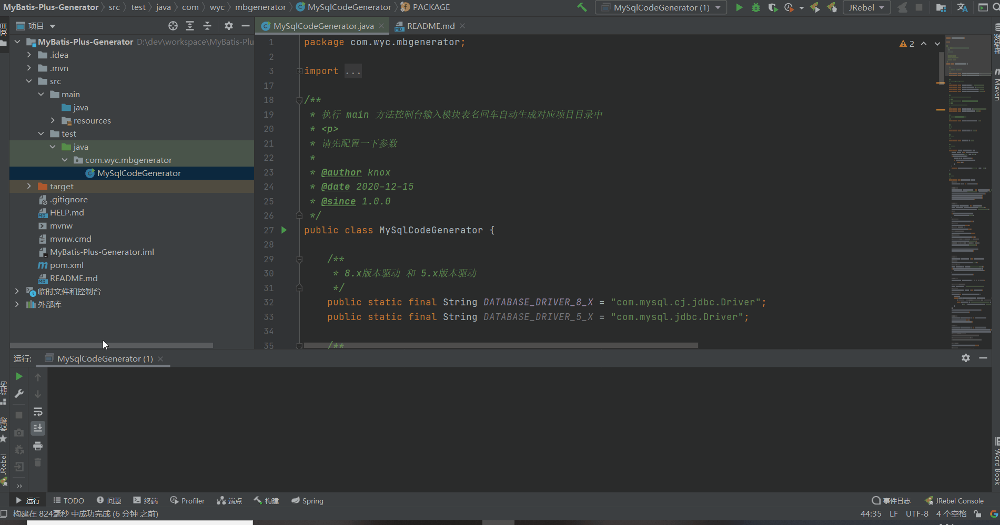
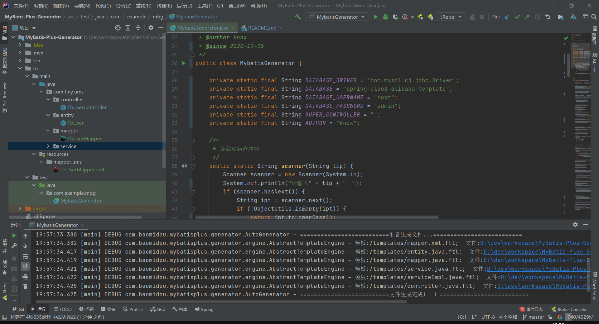

<h2 align="center">MyBatis-Code-Generator</h2>

---
> Mybatis代码生成器，一键生成业务模块代码，大幅提高开发效率。

```text
1. 服务领域模型：XEntity
2. 服务处理器：XController
3. 服务接口：IXService
4. 服务实现类：XServiceImpl
5. 服务DAO：XMapper
6. XML：XMapper.xml
```

### 演示


### 配置项

```java

// 数据库驱动，如果是5.x版本，请更改为：com.mysql.jdbc.Driver
private static final String DATABASE_DRIVER = "com.mysql.cj.jdbc.Driver";
// 数据库
private static final String DATABASE = "";
// 数据库账号
private static final String DATABASE_USERNAME = "root";
// 数据库密码
private static final String DATABASE_PASSWORD = "admin";
// 处理器基类，可不配
private static final String SUPER_CONTROLLER = "";
// 作者，可更改为自己的账号
private static final String AUTHOR = "knox";
```

### 使用说明

1. 进入`com.example.mbg`
2. 执行`MybatisGenerator`文件
3. 输入要生成的包路径名
4. 输入要生产的模块名(如用户管理模块`UMS`)
5. 表名，多个英文逗号分割；若全部生成，请输入`all`

### 结果



